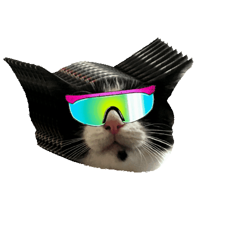

# KwickyMixer

## 🎧 Overview

KwickyMixer is a web application designed to mix music tracks directly from YouTube. The app allows users to crossfade between tracks, control playback, and even loop videos. It's built with Next.js, Radix UI, and utilizes the YouTube Data API for seamless music mixing.

## 🚀 Features

- **Crossfade between YouTube tracks**: Smooth transitions between songs.
- **Playback controls**: Play, pause, and resume YouTube videos.
- **Looping**: Enable or disable looping for videos.
- **AutoMix**: Automatically transition between tracks.

## 🌟 Live Demo

Check out the live demo [here](https://www.kwicky.fr/)

## 🛠️ Installation

To get started with KwickyMixer, follow these steps:

1. **Clone the repository**:

   ```bash
   git clone https://github.com/aagtn/kwickyMixer.git
   cd kwickyMixer
   ```

2. **Install dependencies**:

```bash
npm install
```

3. **Set up environment variables:**:

Create a .env.local file in the root directory with your YouTube API key:
YOUTUBE_API_KEY=your-youtube-api-key

4. **Run the development server:**:

```bash
npm run dev
 ```

Open http://localhost:3000 in your browser to see the app.

## 📦 Building for Production

To build the project for production, use the following command:

```bash
npm run build
```

This will create an optimized production build in the .next folder. You can then start the server with:

```bash
npm start
```

## 👥 Contributing

Contributions are welcome! If you'd like to contribute, please follow these steps:

1. **Fork the repository to your GitHub account.**:

2. **Clone your fork:**:

```bash
https://github.com/aagtn/kwickyMixer.git
cd kwickyMixer
```

3. **Create a new branch for your feature or bugfix:**:

```bash
git checkout -b feature-name
```

4. **Create a new branch for your feature or bugfix:**:

```bash
git commit -m "Description of your changes"
```

5. **Create a new branch for your feature or bugfix:**:

```bash
git push origin feature-name
```

6. **Create a Pull Request from your branch to the main branch of the original repository.**:

Please ensure your code follows the existing style and includes appropriate tests.

## 📄 Acknowledgments

• YouTube API
• Radix UI
• Next.js

Thank you for checking out KwickyMixer! We hope you enjoy using it as much as we enjoyed building it.
